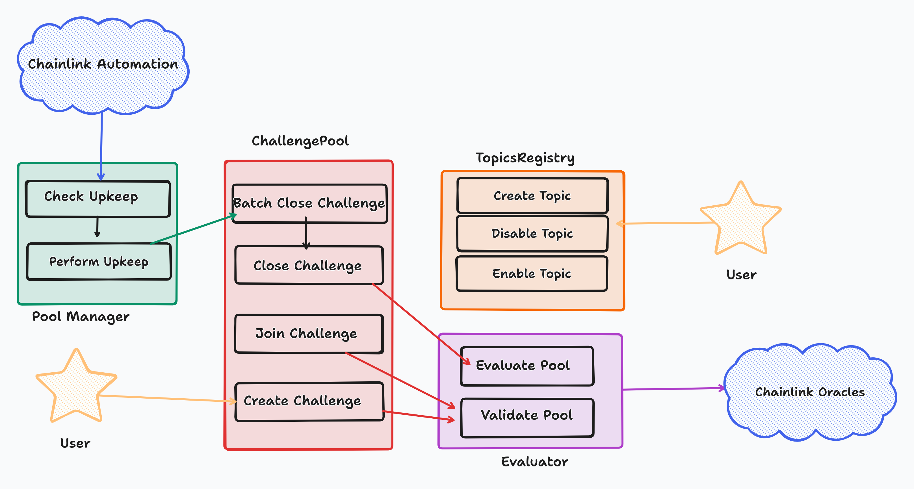

## Smart Contracts
Architecture Diagram of smart contracts.

### ChallengePool
The main contract, keeps track of the challenges being run. 

#### Functions

- Create Challenge
- Join Challenge
- Close Challenge
- Batch Close Challenge

#### Events

- PoolChallenge

### PoolManager
This contracts periodically checks the ChallengePool contract for matured pools and closes them.
It is chainlink keeper compatible and is automated by chainlink automation.

#### Functions

- Check Upkeep
- Perform Upkeep

### TopicRegistry
Keeps track of all challenge topics. 

#### Functions

- Create Topic
- Modify Topic
- Remove Topic

#### Events

- PoolTopic

### Evaluators
These contracts evaluate a pool upon maturity and determines the winners and loosers.
Every challenge topic has a specific evaluator contract for it. By default we have the following;

- AssetPrice Evaluator
- AssetPriceLastValue Evaluator

Aside evaluating a pool upon maturity, it also performs validation functions when a pool is being created or joined.
It communicates with an oracle to validate off-chain data needed to decide on pool winners & loosers.
#### Functions

- Evaluate Pool
- Validate Pool

## Smart Contract Oracles
The oracle to be used depends on the pool topic. For instance the AssetPrice and AssetPriceLastValue
would just need chainlink price feeds oracle. This is simple to use and setup so good choice for mvp.

## Smart Contract Automation
To automate the pool manage contract, chainlink automation is used. The keeper approach is preferred since
it allows off-chain computation to determine which pools are matured and ready to be closed.
## Subgraphs
Subgraphs will be used to index contract events and data as needed.

## Web Application
A standard dapp application to enable easy participation for users.
